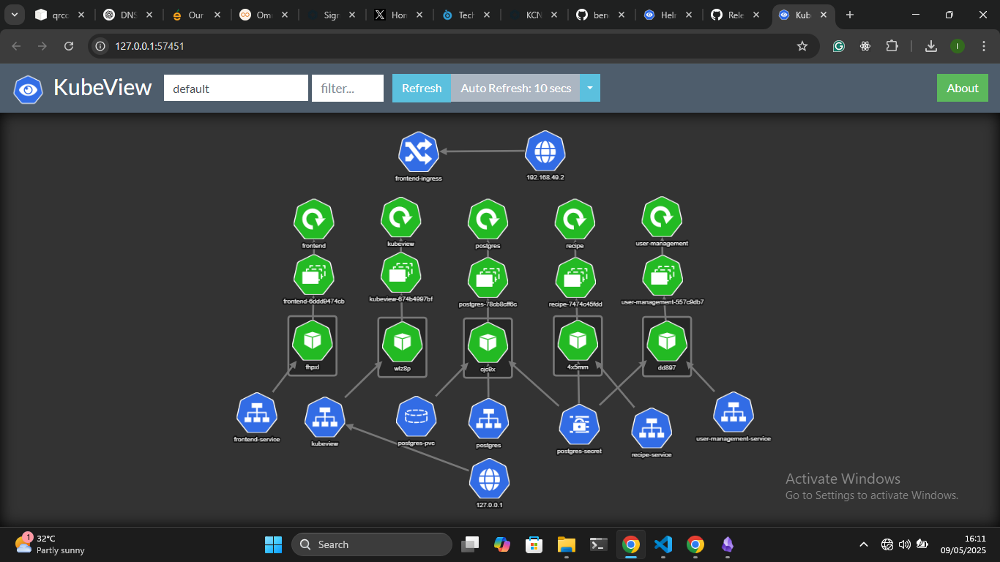

# OmniFood Backend 
A backend infrastructure for a fictional restaurant, Omnifood, using FastAPI. A feature-complete backend with CI/CD, microservices, and containers, deployed on Kubernetes (minikube).



The frontend was developed using HTML, CSS, and JS as part of a Udemy course taught by Jonas Schmedtmann. It was dockerized and runs on an Nginx server. Nginx is used as a static server and reverse proxy for the backend. The backend pods are not exposed to external communication; the only access to the cluster is through the frontend. The frontend is exposed by an ingress connection on the frontend service listening at port 80.


The backend comprises two FastAPI servers connected to a PostgreSQL database in the cluster.

## Technologies 

👌 Frontend (CSS, HTML, JavaScript)

☢️ FastAPI (Python Backend with CORS enabled) 

♨️ Microservices 

🌠 Kubernetes clusters

❤️ CI/CD (Github Actions) 

## Microservices 
### Recipe 
The Recipe microservice provides endpoints for creating, modifying, and accessing Recipe objects. It has the following endpoints.

- `GET /api/v1/recipes` - Get all Recipes
- `GET /api/v1/recipes/{recipe_id}` - Get a specific Recipe
- `POST /api/v1/recipes` - Create Recipe 
- `PUT /api/v1/recipes/{recipe_id}` - Edit a particulare Recipe 

### Recipe Schema 

```json
{
    "name":"Spanish Paella Valenciana",
    "nutriscore":70,
    "tags":"",
    "image":"img/meals/chicken.jpg",
    "calorie":790,
    "rating":"4.6",
    "voting":502
}
```
### Directory Structure 
```
├── Dockerfile
├── app
│   ├── __init__.py
│   ├── __pycache__
│   │   ├── __init__.cpython-312.pyc
│   │   └── main.cpython-312.pyc
│   ├── api
│   │   ├── __init__.py
│   │   ├── __pycache__
│   │   │   ├── __init__.cpython-312.pyc
│   │   │   └── routes.cpython-312.pyc
│   │   └── routes.py
│   ├── db
│   │   ├── __init__.py
│   │   ├── __pycache__
│   │   │   ├── __init__.cpython-312.pyc
│   │   │   ├── database.cpython-312.pyc
│   │   │   ├── db.cpython-312.pyc
│   │   │   ├── dependencies.cpython-312.pyc
│   │   │   └── models.cpython-312.pyc
│   │   ├── database.py
│   │   ├── dependencies.py
│   │   └── models.py
│   ├── main.py
│   └── utils
│       ├── __init__.py
│       ├── __pycache__
│       │   ├── __init__.cpython-312.pyc
│       │   └── seed.cpython-312.pyc
│       ├── script.py
│       ├── seed.py
│       └── seed.txt
├── config.py
└── requirements.txt
```

### User Management
The User management microservice provides endpoints for creating, modifying and accessing user object. It has the following endpoints.

- `GET /api/v1/users` - Get all Users
- `GET /api/v1/users/{user_id}` - Get a specific User
- `POST /api/v1/users` - Create Recipe 

### Directory Structure 
```
├── Dockerfile
├── app
│   ├── __init__.py
│   ├── __pycache__
│   │   ├── __init__.cpython-312.pyc
│   │   └── main.cpython-312.pyc
│   ├── api
│   │   ├── __pycache__
│   │   │   └── routes.cpython-312.pyc
│   │   └── routes.py
│   ├── db
│   │   ├── __pycache__
│   │   │   ├── __init__.cpython-312.pyc
│   │   │   ├── database.cpython-312.pyc
│   │   │   ├── dependencies.cpython-312.pyc
│   │   │   └── models.cpython-312.pyc
│   │   ├── database.py
│   │   ├── dependencies.py
│   │   └── models.py
│   └── main.py
└── requirements.txt
```

## Installation

1. Clone the repository:

```bash
git clone https://github.com/ubterko/omnifoods-backend.git
cd omnifoods-backend
```

2. Create a virtual environment:

```bash
python -m venv venv
source venv/bin/activate  # On Windows: venv\Scripts\activate
```

3. Install dependencies:

```bash
pip install -r requirements.txt
```

## 
Share and star the project.
